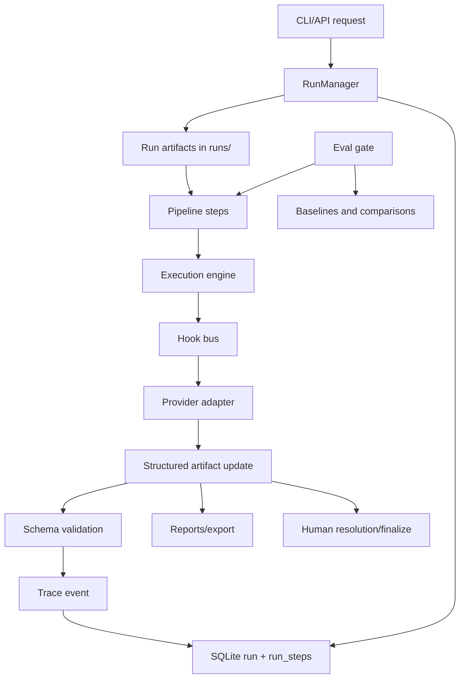

_Created: 24-08-2026 · Last updated: 05-09-2026_

# Gemini Flash Implementation Architecture

Updated: 2026-05-08.

This document turns the unfinished items in `GEMINI_ROADMAP.md` into an implementer-facing architecture plan. It is written for a future Gemini Flash coding pass: small patches, clear file ownership, mock-first verification, and no large rewrite of the existing RuWritingStyles harness.

## Goal

RuWritingStyles already has a custom multi-agent pipeline: prepare -> review -> council -> revision -> verification -> impact/syntax -> reports/export. The next architecture step is not to replace it with LangGraph. The next step is to make the current artifact-first harness:

- measurable through a real eval gate and promoted baselines;
- human-finalizable through `resolution.json`;
- resumable through durable step state;
- observable through richer trace events;
- safer through hooks, budgets, and path/tool boundaries;
- deeper academically through citation and bibliography checks.

## Implementation Rules for Gemini Flash

- Keep changes narrow. One work package should touch one feature area.
- Prefer new modules over large edits to existing dense modules.
- Preserve the artifact-first contract: every important decision must exist as a file under `runs/<run_id>/`.
- Keep CLI and API thin. Both should call the same core functions.
- Do not hardcode provider model IDs in new code. Use `model_policy.yml` and existing provider adapters.
- Do not introduce a vector DB. Add explicit passage ids and metadata first.
- Every new artifact gets a schema in `schemas/`, validation in `validation.py`, and at least one unit test.
- Use `mock` provider for all automated tests.

## Current Extension Points

| Area | Current file | Role |
|---|---|---|
| Pipeline orchestration | `src/ruwritingstyles/pipeline.py` | Sequential full run used by API background tasks. |
| Artifact execution | `src/ruwritingstyles/execution.py` | Provider calls, artifact updates, provider logging. |
| Run creation | `src/ruwritingstyles/runs.py` | Creates `runs/<run_id>/` artifacts and DB row. |
| SQLite index | `src/ruwritingstyles/db.py` | Run metadata and run metrics. |
| CLI surface | `src/ruwritingstyles/cli.py` | Commands and argument parsing. |
| API surface | `src/ruwritingstyles/api.py` | Web Studio endpoints. |
| Eval suite | `src/ruwritingstyles/evals.py` | Eval case/suite execution and comparison. |
| Provider telemetry | `src/ruwritingstyles/provider_log.py` | JSONL provider execution log. |
| Validation | `src/ruwritingstyles/validation.py` | Schema and artifact consistency checks. |

## Target Architecture



The architecture adds a small orchestration layer around the current pipeline, not a new framework. The important new abstraction is a `RunManager`/step tracker that records what happened and lets the process resume.

## Work Package GF-00: Eval Gate Repair

Purpose: make the roadmap's "eval gate" claim true.

Files:

- `scripts/ci-eval-gate.py`
- `.github/workflows/ci.yml`
- `.github/workflows/eval-smoke.yml`
- `tests/test_cli_pipeline.py`
- `docs/scenarios.md`

Changes:

- Replace stale `eval-suite --mode mock` with `eval-suite --provider mock`.
- Ensure subprocess runs from repo root with `PYTHONPATH=src`.
- Prefer existing CLI commands over custom result discovery:
  - `rws eval-suite --provider mock --suite-id ci-smoke`
  - `rws validate-eval-suite runs/ci-smoke`
  - optionally `rws eval-compare <baseline> runs/ci-smoke --strict`
- Add optional CI step for `web`: `npm ci`, `npm run lint`, `npm run build`.

Acceptance:

- `python scripts/ci-eval-gate.py` exits `0` on a clean repo.
- Unit tests still pass.
- The script does not require real provider keys.

## Work Package GF-01: Resolution and Finalization

Purpose: convert human accept/reject decisions into durable artifacts.

New files:

- `src/ruwritingstyles/resolution.py`
- `schemas/resolution.schema.json`
- `schemas/finalization.schema.json`

Touched files:

- `src/ruwritingstyles/cli.py`
- `src/ruwritingstyles/html_summary.py`
- `src/ruwritingstyles/api.py`
- `src/ruwritingstyles/validation.py`
- `tests/test_cli_pipeline.py`

Artifacts:

- `runs/<run_id>/resolution.json`
- `runs/<run_id>/final.md`
- `runs/<run_id>/finalization.json`

`resolution.json` shape:

```json
{
  "run_id": "20260508-demo",
  "status": "draft",
  "decisions": [
    {
      "decision_id": "res-001",
      "source_type": "applied_change",
      "source_id": "change-001",
      "span_id": "p014",
      "action": "accept",
      "reason": "Keeps source caution while improving register.",
      "author_note": ""
    }
  ]
}
```

Allowed `action` values:

- `accept`
- `reject`
- `modify`
- `defer`

Core functions:

- `create_resolution_template(run_dir: Path) -> Path`
- `apply_resolution(run_dir: Path, resolution_path: Path | None = None) -> Path`
- `finalize_run(run_dir: Path, require_resolution: bool = True) -> Path`

Behavior:

- `create_resolution_template` reads `revision.json`, `council.json`, and `revision.diff`.
- `apply_resolution` applies accept/reject/modify decisions to a working final text.
- `finalize_run` writes `final.md` and `finalization.json`; it must not silently overwrite `revised.md`.
- `finalization.json` preserves traceability:
  - source segment
  - finding id
  - council decision
  - applied change
  - human resolution

CLI:

- `rws resolution runs/<run_id>`
- `rws apply-resolution runs/<run_id> [--resolution path]`
- `rws finalize runs/<run_id> [--allow-unresolved]`

API:

- `GET /runs/{run_id}/resolution`
- `PUT /runs/{run_id}/resolution`
- `POST /runs/{run_id}/finalize`

Acceptance:

- A user can reject one applied change and produce `final.md`.
- `validate-run` checks `resolution.json` and `finalization.json` when present.
- Export bundle includes finalization artifacts.

## Work Package GF-02: Durable Step State and Resume

Purpose: make long runs recoverable after interruption.

New file:

- `src/ruwritingstyles/run_manager.py`

Touched files:

- `src/ruwritingstyles/db.py`
- `src/ruwritingstyles/pipeline.py`
- `src/ruwritingstyles/api.py`
- `src/ruwritingstyles/cli.py`
- `tests/test_cli_pipeline.py`

Database table:

```sql
CREATE TABLE IF NOT EXISTS run_steps (
  id INTEGER PRIMARY KEY AUTOINCREMENT,
  run_id TEXT NOT NULL,
  step_id TEXT NOT NULL,
  status TEXT NOT NULL DEFAULT 'pending',
  artifact_path TEXT,
  started_at TIMESTAMP,
  finished_at TIMESTAMP,
  duration_seconds REAL,
  attempt_count INTEGER DEFAULT 0,
  error TEXT,
  UNIQUE(run_id, step_id),
  FOREIGN KEY(run_id) REFERENCES runs(run_id) ON DELETE CASCADE
);
```

Step IDs:

- `prepare`
- `review:<style_id>`
- `council`
- `revision`
- `diff`
- `verification`
- `impact`
- `syntax`
- `report`
- `html_report`
- `latex`
- `bibtex`
- `finalize`

Core API:

- `RunManager.start_step(run_id, step_id, artifact_path=None)`
- `RunManager.complete_step(run_id, step_id, artifact_path=None)`
- `RunManager.fail_step(run_id, step_id, error)`
- `RunManager.step_status(run_id) -> list[dict]`
- `RunManager.next_pending_step(run_id) -> str | None`

Pipeline changes:

- Split `run_full_pipeline` into idempotent step functions.
- Before a step runs, check whether the expected artifact already exists and whether DB says complete.
- `resume_run(repo_root, run_id, provider_name, model=None, profile="researcher")` continues from the first failed or pending step.

CLI:

- `rws run-status runs/<run_id>` or `rws run-status <run_id>`
- `rws resume <run_id> --provider mock`

API:

- `GET /runs/{run_id}/status` returns run row plus `steps`.
- `POST /runs/{run_id}/resume`

Acceptance:

- A test can mark `review:gasparov` complete and resume from `council`.
- Failed runs expose step error in API and CLI.
- Resume does not rerun completed provider calls.

## Work Package GF-03: Trace Events, Budget Modes, and Context Builder

Purpose: make output quality, cost, and context measurable.

New files:

- `src/ruwritingstyles/tracing.py`
- `src/ruwritingstyles/context.py`
- `schemas/context-snapshot.schema.json`

Touched files:

- `src/ruwritingstyles/provider_log.py`
- `src/ruwritingstyles/execution.py`
- `src/ruwritingstyles/config.py`
- `model_policy.yml`
- `schemas/model-policy.schema.json`
- `src/ruwritingstyles/validation.py`

Trace event additions:

- `trace_id`
- `step_id`
- `schema_name`
- `prompt_chars`
- `response_chars`
- `estimated_input_tokens`
- `estimated_output_tokens`
- `cost_estimate_usd`
- `schema_repair_count`
- `budget_mode`
- `context_snapshot_path`

Budget modes:

- `smoke`: mock/local only, minimal styles, no expensive verification.
- `standard`: normal MVP run.
- `expensive`: real provider and full verifier allowed.
- `verifier_only`: run or rerun verification against existing revision.

Context builder:

- `build_review_context(...)`
- `build_council_context(...)`
- `build_revision_context(...)`
- `build_verification_context(...)`
- `write_context_snapshot(run_dir, step_id, context) -> Path`

Context rules:

- Include selected style passports, not all passports.
- Include selected knowledge passages with passage ids.
- Replace long documents or tool outputs with a path plus preview.
- Preserve the distinction between "retrieved" and "proven".
- Never include API keys or full local absolute paths in model context.

Acceptance:

- Provider log remains backward-compatible enough for existing reports.
- `validate-run` accepts old logs and validates new fields when present.
- Every executed provider call can point to a context snapshot.

## Work Package GF-04: Hooks and Guardrails

Purpose: create reusable safety and instrumentation extension points.

New files:

- `src/ruwritingstyles/hooks.py`
- `src/ruwritingstyles/guardrails.py`

Touched files:

- `src/ruwritingstyles/execution.py`
- `src/ruwritingstyles/runs.py`
- `src/ruwritingstyles/validation.py`

Hook points:

- `session_start`
- `pre_provider_call`
- `post_provider_call`
- `pre_write_artifact`
- `post_schema_validate`
- `pre_finalize`
- `stop_on_risk`

Default hooks:

- redact secrets from trace/log text;
- reject artifact writes outside `runs/<run_id>/`;
- enforce budget mode;
- count schema repair attempts;
- block finalization when verifier status is `failed`;
- require human decision for `deferred` and `needs_human_review`.

Design:

```python
@dataclass
class HookContext:
    repo_root: Path
    run_dir: Path
    step_id: str
    task: str
    provider: str | None = None
    model: str | None = None
    metadata: dict[str, Any] = field(default_factory=dict)
```

Acceptance:

- A test hook can block a provider call for `budget_mode=smoke`.
- A path guard rejects writes outside the run directory.
- Existing mock pipeline still works without custom hooks.

## Work Package GF-05: Citation and Bibliography Architecture

Purpose: move from static `references.bib` to source-aware scholarly apparatus.

New files:

- `src/ruwritingstyles/bibliography.py`
- `src/ruwritingstyles/citations.py`
- `schemas/bibliography.schema.json`
- `schemas/citation-check.schema.json`

Touched files:

- `src/ruwritingstyles/bibtex.py`
- `src/ruwritingstyles/verification.py`
- `src/ruwritingstyles/report.py`
- `src/ruwritingstyles/html_summary.py`
- `src/ruwritingstyles/export.py`

Artifacts:

- `bibliography.json`
- `citation-check.json`
- `references.bib`

Bibliography input modes:

- existing local `.bib`;
- pasted BibTeX;
- later Zotero export file;
- later Zotero API integration, only after local file workflow is stable.

Data model:

```json
{
  "sources": [
    {
      "source_id": "zaliznyak-2004-novgorod",
      "type": "book",
      "title": "Drevnenovgorodsky dialekt",
      "author": ["A. A. Zaliznyak"],
      "year": "2004",
      "bibtex_key": "Zaliznyak2004Novgorod",
      "reliability": "primary",
      "local_paths": ["PDFtoTXT/zaliznyak_drevnenovgorodsky_dialekt_2004.txt"]
    }
  ]
}
```

Citation checks:

- name/date consistency;
- known bibliography key exists;
- direct quotation preserved;
- transliteration consistency;
- citation appears in `references.bib`;
- unsupported source claim becomes `needs_human_review`.

Acceptance:

- `rws bibliography import file.bib` creates `bibliography.json`.
- `rws citation-check runs/<run_id>` writes `citation-check.json`.
- Verifier can include citation warnings in `verification.json`.

## Suggested Implementation Order

1. GF-00 Eval Gate Repair.
2. GF-02 Durable Step State, but only DB table plus `run-status` first.
3. GF-01 Resolution and Finalization, CLI first.
4. GF-03 Trace Events, keeping old provider log readers working.
5. GF-04 Hooks, starting with path guard and budget guard.
6. GF-05 Bibliography and Citation Checks, local BibTeX first.
7. API/Web integration after CLI behavior is stable.

## Test Matrix

Required local checks after each work package:

```bash
python -m compileall -q src tools tests
python tools/validate_project.py
python -m unittest discover -s tests
```

Additional checks for web/API work:

```bash
cd web
npm run lint
npm run build
```

Feature-specific tests:

- GF-00: `python scripts/ci-eval-gate.py`
- GF-01: create resolution -> reject one change -> finalize -> validate/export.
- GF-02: interrupted mock run -> resume -> no duplicate provider calls.
- GF-03: provider log contains trace fields and old reports render.
- GF-04: guardrail blocks bad path and budget overrun.
- GF-05: import BibTeX -> citation check -> report/export includes artifacts.

## Non-Goals

- Do not migrate to LangGraph in this pass.
- Do not add a queue system before durable step state exists.
- Do not add a vector database.
- Do not make Web Studio the source of truth.
- Do not let Gemini Flash choose provider model IDs without checking official provider docs and updating `model_policy.yml`.
- Do not make final export possible without traceable human resolution once finalization exists.

_Dr. Mārcis Gasūns_
