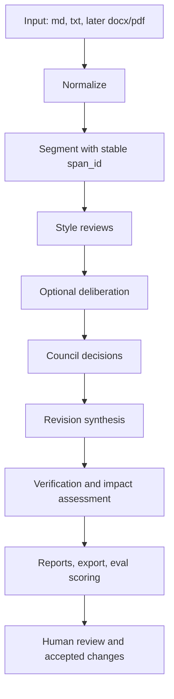

# Roadmap RuWritingStyles

Обновлено: 2026-05-08.

Этот документ описывает, как развивать RuWritingStyles из набора стилевых инструкций и CLI-прототипа в воспроизводимую лабораторию филологической редакции: загрузка текста, разметка, несколько стилевых рецензентов, совет, правка, проверка, отчет, экспорт и накопление качества через eval-наборы.

## Северная звезда

RuWritingStyles должен помогать автору или редактору улучшать научный текст без потери фактической осторожности, источниковедческой дисциплины и авторского замысла.

Ключевой продуктовый принцип: система не должна просто переписывать текст "красиво". Она должна показывать, где именно текст слаб, какие стили или школы видят проблему, почему правка допустима, что осталось нерешенным и какие изменения нельзя делать без человека.

## Текущее состояние
 
 На 2026-05-08 проект перешел в фазу v2.3.0 (production-ready):
 
 - CLI с командами `prepare`, `run`, `review`, `council`, `deliberate`, `revise`, `verify`, `assess`, `scrutiny`, `eval-suite`, `eval-compare`, `eval-promote`, `eval-regression`, `apply-resolution`, `finalize`, `resume`, `export` и другими.
- Локальный pipeline на артефактах в `runs/`.
- Детерминированный `mock` provider для тестов.
- Провайдерные адаптеры для OpenAI, Google, Anthropic и OpenRouter.
- JSON Schema validation для run, eval suite, provider status и сравнений; схемы синхронизированы с полями `clusters`, `profile`, `bloom_level`, `primary_school`, `influence`.
- HTML summary с findings, council, revision, verification, provider log и visual diff.
- Web Studio на React/Vite с FastAPI backend, multi-run comparison и production-раздачей `web/dist` из API.
- Eval-наборы для регрессионной проверки: текущий manifest содержит 33 кейса.
- Style passports, manifest и набор исходных ClaudeStyles; текущий MVP council set содержит 6 стилей.
- SQLite index `rws.db` поверх переносимых artifacts в `runs/`.
- Dockerfile и `docker-compose.yml` для контейнерного запуска.
- Knowledge base и первые инструменты для scrutiny, migration, peer review, sentiment и project consistency.

Последний стабильный checkpoint:

```bash
python -m unittest discover -s tests
python tools/validate_project.py
python -m compileall -q src tools tests
cd web
npm.cmd run lint
npm.cmd run build
```

## Архитектурная рамка

Источник истины должен оставаться в core pipeline и файловых артефактах. CLI и API не должны расходиться по логике.



Архитектурные правила:

- Core pipeline first: `src/ruwritingstyles/*` содержит бизнес-логику.
- CLI thin: CLI собирает аргументы и вызывает core.
- API thin: FastAPI вызывает те же core-функции, что CLI.
- Web thin: Web Studio не принимает филологических решений, а отображает состояние run и отправляет команды.
- Artifacts first: каждый запуск можно открыть, проверить, экспортировать и повторить.
- Schemas first: все LLM-ответы проходят через явные JSON-контракты.
- Human-in-the-loop: спорные решения не замалчиваются, а выносятся как unresolved/deferred.

## Основные продуктовые треки

### 1. Web Studio

Цель: сделать первый экран реальным рабочим местом редактора.

Развивать:

- список run с фильтрами по статусу, провайдеру, дате, входному файлу и ошибкам;
- создание нового run с выбором файла, провайдера, модели, стилей, режима `mock` или real API;
- отображение прогресса pipeline по шагам;
- side-by-side original/revised с подсветкой изменений;
- панель findings по `span_id`, severity, style_id и type;
- council view: решения, причины, disagreements, deferred items;
- ручное принятие или отклонение отдельных правок;
- экспорт markdown/html/zip из UI;
- просмотр provider log и retry telemetry;
- безопасную обработку ошибок API без молчаливых fail-state.

Критерий готовности: пользователь может через Web Studio запустить `mock` pipeline на `.md` файле, увидеть все артефакты, принять или отклонить изменения и экспортировать результат.

### 2. Human-in-the-loop редактура

Цель: не давать модели финально менять текст без понятного редакторского контроля.

Развивать:

- формат `resolution.json` для ручных решений;
- команды `rws apply-resolution` и `rws finalize`;
- UI для accept/reject по каждому diff hunk или applied_change;
- журнал ручных решений;
- повторную генерацию revision с учетом ручных запретов;
- сохранение author intent notes;
- режим "только комментарии", где система не пишет revised.md.

Критерий готовности: финальная версия документа всегда объяснима через цепочку source segment -> finding -> council decision -> applied change -> human resolution.

### 3. Качество филологической проверки

Цель: перейти от технически работающего pipeline к содержательно полезному.

Развивать:

- больше eval cases для этимологии, источников, перевода, комментария, датировки, терминологии и регистра;
- gold baselines для разных типов задач;
- scoring по hallucination, source preservation, diff magnitude, factual caution и style fidelity;
- negative tests, где модель не должна менять текст;
- adversarial cases: псевдоэтимология, ложные источники, сверхобобщения, неверные параллели;
- cross-provider comparison reports;
- ручную разметку expected findings для эталонных документов.

Критерий готовности: перед добавлением нового провайдера, стиля или prompt-изменения можно запустить eval suite и увидеть, где качество выросло или просело.

### 4. Стили и паспорта

Цель: сделать стили управляемыми, тестируемыми и расширяемыми.

Развивать:

- версионирование style passports;
- anchors для каждого стиля;
- style regression tests;
- карту компетенций стилей;
- веса стилей по типам задач;
- генератор паспорта из ClaudeStyles с обязательной ручной проверкой;
- stylebook, который объясняет не только "как писать", но и "когда этот стиль не применять";
- конфликтные пары стилей: где они должны спорить, а где один имеет приоритет.

Критерий готовности: новый стиль можно добавить через паспорт, anchors, schema validation и минимальный eval-run, не меняя core pipeline.

### 5. Совет, deliberation и peer review

Цель: превратить multi-agent часть из декоративной в проверяемую.

Развивать:

- явный формат disagreement clusters;
- deduplication findings по смыслу и `span_id`;
- council archetypes с измеримыми стратегиями;
- multi-turn deliberation только там, где есть реальный конфликт;
- peer review второго совета после revision;
- A/B comparison council archetypes;
- правила, когда совет обязан вернуть `deferred`;
- объяснение, почему finding принят, отклонен или превращен в informational.

Критерий готовности: council не просто суммирует findings, а надежно снижает шум, объединяет дубли, сохраняет важные разногласия и не пропускает risky edits.

### 6. Verification, scrutiny и fact-checking loop

Цель: отделить хорошую стилистическую правку от опасной фактической правки.

Развивать:

- более строгий verifier для claims, citations, dates, names, terms;
- scrutiny mode для анахронизмов, псевдоисторических выводов и ложных параллелей;
- knowledge base retrieval с указанием источника;
- unresolved claims с требованием человеческой проверки;
- повторный council pass после verification warnings;
- impact assessment для protected qualities: meter, rhyme, tone, quotation integrity, source wording;
- запрет на добавление новых фактов без evidence trail.

Критерий готовности: если revision добавляет неподтвержденный факт, verifier должен поймать это до финального экспорта.

### 7. Корпус, knowledge base и источники

Цель: дать системе память о корпусе, но не смешивать retrieval с доказательством.

Развивать:

- нормализацию PDFtoTXT и docx extraction;
- corpus index с метаданными: автор, год, жанр, источник, язык, надежность;
- поиск по knowledge base с цитируемыми passage ids;
- ручное подтверждение источников;
- режим "обнаружить, но не утверждать";
- import pipeline для новых книг и статей;
- отдельный слой для пользовательских проектов и project-context.

Критерий готовности: finding может ссылаться на corpus evidence, но система явно различает "найдено похожее место" и "доказано".

### 8. Провайдеры, модели и стоимость

Цель: не зависеть от одного LLM и иметь контроль качества/стоимости.

Развивать:

- provider capability matrix;
- model policy с task routes и budget modes;
- provider-specific structured output quirks;
- retries, backoff, timeout и partial failure recovery;
- cost logging и token accounting, если провайдер дает данные;
- benchmark по моделям через `eval-benchmark`;
- "cheap first pass, strong final verifier" режим;
- регулярное обновление model ids после проверки официальных provider docs.

Критерий готовности: пользователь может выбрать быстрый/дешевый/строгий режим и увидеть, чем он рискует.

### 9. Отчеты, экспорт и публикационный workflow

Цель: результат должен быть удобен для автора, редактора и ревьюера.

Развивать:

- clean `revised.md`;
- `report.md` для ревью;
- `summary.html` для интерактивного просмотра;
- zip export с manifest;
- docx export;
- GitHub issue/PR export для обсуждения;
- changelog по ручным решениям;
- public/private mode для удаления чувствительных путей и ключей из отчетов.

Критерий готовности: результат можно отправить человеку, который не запускал проект локально, и он поймет, что изменено и почему.

### 10. DevEx, CI и надежность

Цель: каждое изменение в pipeline должно быть проверяемым.

Развивать:

- CI на Python tests и project validation; frontend lint/build остаются обязательными локальными release checks и могут быть добавлены в GitHub CI отдельным шагом;
- golden artifact tests;
- schema versioning;
- migration scripts для старых runs;
- typed boundaries между core/API/UI;
- fixtures для API и Web Studio;
- smoke workflow на GitHub Actions;
- pre-commit checks для encoding, line endings и diff sanity;
- release checklist.

Критерий готовности: pull request не может случайно сломать run artifacts, schema validation или Web Studio build.

## Фазы развития

### Фаза 0. Стабилизация каркаса
 
 Статус: Завершена (v2.3.0).
 
 Готово:
 
 - CLI pipeline работает с `mock`.
 - Eval suite и validation проходят.
 - API routes не дублируются.
 - Web build/lint проходят.
 - OpenRouter включен в provider policy.
 - **CI Golden Gate**: Внедрена обязательная проверка регрессии против `gold.json`.
 - **Service Layer**: Бизнес-логика вынесена в `resolution.py`.
 - **Security**: Харденинг хуков и устранение `FrozenInstanceError`.

Осталось:

- добавить CI, который запускает те же проверки;
- обновить README/quickstart после последних изменений;
- убрать или оформить scratch scripts;
- зафиксировать policy по работе через branch/PR или direct main.

### Фаза 1. Надежный локальный продукт

Цель: один пользователь запускает проект локально и получает полезный результат.

Задачи:

- Web Studio: robust new run modal, provider readiness, progress, error states;
- API: job status endpoint и run step state;
- CLI: единый `rws run --mode comments|revision|strict`;
- docs: clear local setup для Windows/PowerShell;
- export: stable zip и human-readable report.

Definition of done:

- новый пользователь может пройти quickstart без правок кода;
- `mock` run работает через CLI и Web;
- real provider readiness понятен до запуска;
- ошибки не оставляют полусломанный run без статуса.

### Фаза 2. Редакторский контроль

Цель: пользователь принимает решения, а не просто получает revised.md.

Задачи:

- resolution format;
- accept/reject in HTML summary and Web Studio;
- apply/finalize commands;
- regenerate after human feedback;
- unresolved queue.

Definition of done:

- можно отклонить отдельную правку;
- финальный документ строится из выбранных решений;
- отчет сохраняет историю human decisions.

### Фаза 3. Качество и eval discipline

Цель: начать измерять содержательное качество.

Задачи:

- поддерживать текущий eval manifest из 33 cases и расширять его только с понятными gold annotations;
- добавить gold annotations;
- ввести provider/model leaderboard;
- добавить style regression anchors;
- хранить baseline snapshots;
- сделать `eval-regression` частью CI.

Definition of done:

- изменение prompt, schema или provider adapter сопровождается eval diff;
- regression visible before merge;
- есть список "known weak cases".

### Фаза 4. Корпус и источники

Цель: подключить реальные источники и сделать retrieval полезным, но осторожным.

Задачи:

- corpus metadata;
- import docx/pdf;
- passage ids;
- knowledge search report;
- source confidence;
- manual source approval.

Definition of done:

- finding может ссылаться на source passage;
- verifier различает supported, unsupported и needs_source;
- пользователь видит, какие источники использованы.

### Фаза 5. Расширение стилей и жанров

Цель: покрыть больше задач без расползания качества.

Задачи:

- новые style passports;
- anchors per style;
- style conflict map;
- genre profiles: article, commentary, review, translation note, popular essay;
- migration flow между стилями;
- project consistency для набора документов.

Definition of done:

- стиль нельзя добавить без anchors и минимального eval;
- project-run поддерживает consistency across files;
- migration produces traceable changes.

### Фаза 6. Productization

Цель: сделать инструмент устойчивым для долгой работы.

Задачи:

- persistent job queue;
- optional database index поверх файловых runs;
- auth only if needed;
- packaging;
- release artifacts;
- privacy modes;
- cost controls;
- documentation site.

Definition of done:

- проект можно установить, обновить и использовать без знания внутренней структуры репозитория;
- runs остаются переносимыми;
- пользователю понятно, что отправляется внешним провайдерам.

## Приоритетный план на ближайшие шаги

### Следующий день работы

1. Держать README, quickstart и deployment docs синхронными с текущим Web/API/pipeline.
2. Поддерживать GitHub Actions CI для Python tests и `validate_project`; добавить frontend lint/build в CI, если сборка Web Studio станет обязательным gate.
3. Сделать API endpoint `/runs/{run_id}/status` или расширить `/runs/{run_id}` step-state.
4. Доработать Web error/loading states и статусы долгих фоновых задач.
5. Запустить один реальный provider smoke на коротком документе и сохранить заметки.

### Следующая неделя

1. Реализовать resolution format.
2. Сделать accept/reject в Web Studio или HTML summary не как download-only demo, а как вход в finalize.
3. Поддерживать текущие 33 eval cases и добавить targeted evals только для новых кластеров, провайдеров или prompt-изменений.
4. Добавить style regression anchors для 2-3 ключевых стилей.
5. Описать provider capability matrix.

### Следующий месяц

1. Довести Web Studio от локального MVP до устойчивого редакторского workbench.
2. Добавить corpus import для docx и нормализованных txt/pdf outputs.
3. Сделать project-run с наглядным project dashboard.
4. Ввести baseline promotion workflow.
5. Подготовить первый tagged release.

## Вопросы к владельцу проекта

Продуктовые вопросы:

1. Главный пользователь кто: ты как исследователь, внешний филолог, редактор журнала, студент, автор статьи?
2. Главный результат какой: исправленный текст, подробный отчет, учебная критика, проверка гипотез или все сразу?
3. Нужно ли по умолчанию менять текст, или безопаснее сначала давать только комментарии?
4. Какой формат входа важнее всего после `.md` и `.txt`: `.docx`, `.pdf`, Google Docs, HTML?
5. Для каких языков проект должен быть первым: русский научный текст, английский academic prose, санскрит/древние языки в комментариях, смешанные тексты?
6. Какие стили являются ядром продукта, а какие экспериментальные?
7. Какие 5 документов должны стать золотым тестовым набором?
8. Нужно ли сохранять авторский голос даже ценой меньшей "идеальности" текста?
9. Должен ли Web Studio быть только локальным инструментом или в будущем веб-сервисом?
10. Нужен ли режим для конфиденциальных текстов, где запрещены внешние API?

Инженерные вопросы:

1. Оставляем `runs/` как главный storage или вводим SQLite/Postgres индекс поверх файлов?
2. API должен выполнять pipeline синхронно или через job queue?
3. Нужно ли делать branch/PR workflow обязательным для всех изменений в репозитории?
4. Какие real providers реально доступны ключами и бюджетом?
5. Нужен ли token/cost accounting уже сейчас?
6. Какой минимальный CI gate обязателен перед push в `main`?
7. Старые run artifacts можно ломать schema migration, или нужна backward compatibility?
8. Нужно ли сохранять все prompts целиком, если в них могут быть приватные тексты?
9. Какой формат release: Python package, desktop/local web app, Docker, просто GitHub repo?
10. Какие данные можно использовать для eval baselines без юридических и приватных рисков?

Филологические вопросы:

1. Где граница между стилистической правкой и содержательной научной рецензией?
2. Когда совет стилей имеет право сказать "правку делать нельзя"?
3. Какие источники считаются авторитетными для каждого домена?
4. Нужно ли ранжировать стили по научному весу, или совет должен быть равноправным?
5. Как фиксировать спорные, но допустимые интерпретации?
6. Какие типы ошибок самые дорогие: ложная этимология, неверный источник, регистр, чрезмерная уверенность, потеря нюанса?
7. Нужно ли отдельно проверять цитаты, транслитерацию, имена, даты и библиографию?
8. Какие жанры нельзя править теми же правилами, что научную статью?

## Решения, которые нужно принять

| Решение | Варианты | Рекомендация |
|---|---|---|
| Основной UX | CLI-first, Web-first, dual | Dual, но core pipeline first |
| Storage | только файлы, SQLite index, full DB | Файлы плюс текущий SQLite index `rws.db` |
| Default mode | comments, revision, strict | comments для новых пользователей, revision для explicit run |
| Real providers | один основной, несколько | несколько, качество через eval |
| Human approval | optional, required | required для финального export |
| CI policy | advisory, required | required для main |
| Style expansion | быстро много, медленно с anchors | медленно с anchors |
| Corpus retrieval | автоматическое доверие, осторожная подсказка | осторожная подсказка |

## Definition of done для MVP

MVP считается готовым, когда:

- `rws run` и Web Studio создают один и тот же тип run artifacts;
- пользователь видит original, revised, findings, council decisions, verification warnings и diff;
- можно запустить `mock` без ключей и real provider при наличии ключа;
- можно валидировать run и экспортировать zip;
- есть стабильный eval manifest с минимум 33 cases и понятным baseline workflow;
- CI запускает основные проверки;
- документация объясняет локальную установку, provider setup и безопасные ограничения;
- ни один финальный документ не создается без traceable decisions.

## Антицели

Не развивать проект в эти стороны:

- генератор красивого текста без объяснения правок;
- чат без артефактов;
- один гигантский prompt вместо pipeline;
- скрытая отправка приватных текстов внешним API;
- стили без anchors и проверок;
- совет агентов как декоративный диалог без schema validation;
- автоматическое принятие рискованных фактических изменений.

## Короткий ориентир

Сначала надо сделать RuWritingStyles надежным локальным инструментом для одного пользователя. Потом добавить редакторский контроль. Затем расширять качество через evals и corpus. И только после этого превращать его в более широкий продукт.

---

## Дополнение от 2026-05-08: Критика, Стилистический анализ и План "Gemini-Ready"

### 1. Критика текущего Roadmap

**Сильные стороны:**
- **Инженерная четкость:** Пайплайн (Core -> CLI -> API -> Web) прописан безупречно.
- **Eval-центричность:** Понимание, что без автоматизированных тестов качества (eval suite) LLM-система превращается в "черный ящик".
- **Human-in-the-loop:** Верный акцент на том, что окончательное решение — за редактором.

**Слабые стороны (точки роста):**
- **Плоская структура стилей:** Стили в `manifest.yml` свалены в одну кучу. Нет разделения на *фундаментальные лингвистические нормы*, *доменные стили* (напр. палеославистика) и *авторские идиолекты*.
- **Отсутствие "Весов Доверия":** В `roadmap.md` не указано, как разрешать конфликты между общим академическим стилем и специфическими привычками автора (частными стилями).
- **Скудность метаданных:** Паспорта стилей пока слишком технические, в них мало филологической рефлексии о том, *почему* стиль именно такой.

### 2. Стилистические группы (на основе анализа philology.ru/linguistics.htm)

Анализ корпуса статей портала позволяет выделить следующие **функционально-стилистические кластеры**, которые должны стать основой для группировки стилей в проекте:

1.  **Теоретико-методологический (Meta-linguistic):**
    *   *Фокус:* Понятийный аппарат, дефиниции, логическая строгость.
    *   *Примеры:* Общее языкознание, семиотика.
2.  **Описательно-аналитический (Descriptive):**
    *   *Фокус:* Фактология, примеры (иллюстративный материал), морфологический/синтаксический разбор.
    *   *Примеры:* Грамматические очерки, описания конкретных языков.
3.  **Историко-филологический (Diachronic/Source-oriented):**
    *   *Фокус:* Работа с источниками, этимология, транслитерация, палеография. Высокое требование к точности цитирования.
    *   *Примеры:* История языка, древнеславянские исследования.
4.  **Нормативно-стилистический (Prescriptive/Culture of Speech):**
    *   *Фокус:* Литературная норма, культура речи, исправление "ошибок".
    *   *Примеры:* Стилистика русского языка.
5.  **Компаративный (Comparative/Translational):**
    *   *Фокус:* Межъязыковые параллели, переводческий комментарий.

**Обобщенный опыт (Generalized Experience):** Лингвистический текст — это баланс между *объективностью данных* и *субъективностью терминологического выбора* школы. Хорошая правка не должна навязывать "среднеарифметический" стиль, если текст принадлежит к ярко выраженной школе (напр. Московской или Ленинградской).

### 3. План добавления "Частных стилей" (Private Styles)

Частный стиль — это "паспорт идиолекта" конкретного автора или узкой группы. 

**Стратегия внедрения:**
- **Уровень 1: Template.** Создать `styles/private_template.yml`, включающий:
    - *Favorite lexemes:* (напр. Зализняк любит "по-видимому", "заметим").
    - *Syntactic patterns:* (длина предложений, использование пассива/актива).
    - *Tone:* (степень категоричности, использование "мы" vs "автор").
- **Уровень 2: Inheritance.** Ввести в `manifest.yml` поле `extends`. Частный стиль `private:zalizniak` расширяет доменный стиль `domain:diachronic`.
- **Уровень 3: Style Mixin.** В пайплайне `council` должен уметь подмешивать частный стиль с высоким весом, если определен автор текста.

### 4. План-инструкция для Gemini (Pro/Flash)

Этот план составлен так, чтобы любая современная LLM могла продолжить работу автономно.

**Ближайшие задачи (Milestones):**

1.  **Рефакторинг Манифеста:** 
    - Перевести `styles/manifest.yml` на иерархическую структуру (Core -> Domains -> Private).
    - Добавить теги из групп (Теоретический, Описательный и т.д.) к существующим паспортам.
2.  **Генератор Паспорта (Prompt-Engineering):**
    - Написать системный промпт для "Style Architect" (модели Flash/Pro), который принимает на вход 2-3 статьи автора и выдает готовый `.yml` паспорт в формате RuWritingStyles.
3.  **Council 2.0 (Logic):**
    - Обновить логику `council` (в `src/ruwritingstyles/council.py`), чтобы он учитывал `domain` текста. Если текст помечен как "исторический", веса стилей группы "Historical" автоматически увеличиваются на 30%.
4.  **Knowledge Base Expansion:**
    - Использовать статьи с `philology.ru` для создания "золотых стандартов" (Golden Baselines) по каждой группе.

**Критерий успеха для Gemini:** "Система автоматически определяет домен текста и предлагает подключить соответствующий набор стилевых агентов (напр. Описательный + Частный стиль автора)".
