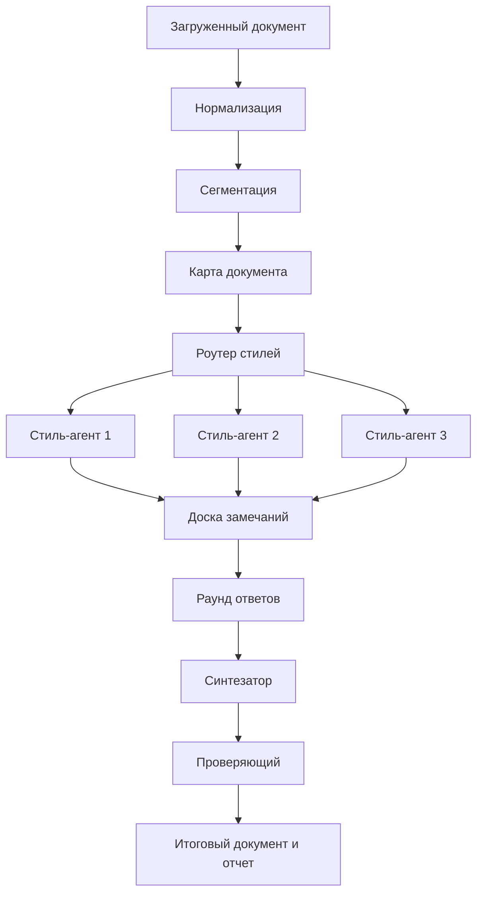

# Roadmap разработки RuWritingStyles

Этот документ описывает развитие RuWritingStyles от каталога пользовательских стилей к системе автоматической стилевой редакции. Главная цель: один загруженный документ должен проверяться несколькими стилями, получать независимые замечания, проходить обсуждение между стилями и возвращаться пользователю как улучшенная версия с прозрачным diff и отчетом.

## Видение

RuWritingStyles должен стать не только набором `.md`-инструкций для Claude, но и воспроизводимой лабораторией письма:

- стиль остается читаемой инструкцией для человека;
- стиль получает машинно-читаемый паспорт;
- документ разбивается на адресуемые фрагменты;
- каждый стиль работает как экспертная линза;
- замечания стилей собираются в общую доску;
- стили могут соглашаться, возражать и уточнять замечания друг друга;
- итоговый редактор применяет только объяснимые изменения;
- проверяющий сверяет новую версию с исходником.

Ключевой принцип: стили не должны соревноваться за право переписать весь текст. Они сначала проверяют, затем спорят о конкретных местах, и только после этого отдельный синтезатор собирает итоговую редакцию.

## Целевой пользовательский сценарий

Пользователь загружает документ и выбирает режим:

```bash
rws run article.md --styles zalizniak-ocherk,zalizniak-zametki,tronsky-readings --mode council
```

На выходе создается воспроизводимый запуск:

```text
runs/2026-05-06-demo/
  original.md
  normalized.md
  segments.json
  reviews/
    zalizniak-ocherk.json
    zalizniak-zametki.json
    tronsky-readings.json
  council.json
  revised.md
  revised.diff.md
  report.md
```

Пользователь видит исходный документ, замечания каждого стиля, места согласия и расхождения между стилями, итоговую улучшенную версию, diff с объяснением правок и список нерешенных вопросов, которые требуют человека.

## Архитектура



## Этап 0. Укрепление текущего каталога

Цель: привести существующие стили к виду, удобному для дальнейшей автоматизации.

Задачи:

- сохранить все текущие `.md`-стили в `ClaudeStyles/`;
- добавить единый индекс стилей в машинно-читаемом формате;
- описать для каждого стиля роль, область применения, сильные проверки и ограничения;
- проверить, что README ссылается на все стили и источники;
- отделить пользовательскую документацию от внутренней документации разработки.

Ожидаемый результат:

```text
styles/
  manifest.yml
docs/
  roadmap.md
  style-contract.md
  agent-protocol.md
```

## Этап 1. Машинный паспорт стиля

Цель: дать каждому стилю формальный контракт, который оркестратор сможет читать без ручной интерпретации README.

Минимальный паспорт:

```yaml
id: zalizniak-zametki
name: Зализняк-заметки
source_prompt: ClaudeStyles/zalizniak-zametki-style.md
role: polemical_linguistic_reviewer
best_for:
  - псевдоэтимологии
  - внешнее сходство слов
  - произвольные звуковые замены
checks:
  - unsupported_etymology
  - arbitrary_sound_change
  - weak_historical_inference
limits:
  - не заменяет источниковедческий аппарат
  - не должен превращать нейтральный текст в публицистику
```

Ожидаемый результат:

- `styles/manifest.yml`;
- один `.yml`-паспорт на каждый стиль;
- валидация паспортов простой схемой.

## Этап 2. Нормализация и сегментация документов

Цель: любой входной документ превращается в Markdown с устойчивыми идентификаторами фрагментов.

Поддержать сначала:

- `.md`;
- `.txt`;
- позже `.docx`;
- позже `.pdf` через отдельный конвертер.

Формат сегментов:

```json
{
  "document_id": "article",
  "segments": [
    {
      "span_id": "p001",
      "type": "paragraph",
      "text": "..."
    }
  ]
}
```

Почему это важно: агенты должны спорить не о тексте вообще, а о конкретном абзаце, заголовке, примере или тезисе.

Текущее состояние: добавлен первый CLI-слой `rws prepare`, который поддерживает `.md` и `.txt`, создает `runs/<run-id>/original.md`, `normalized.md`, `segments.json` и `report.md`. Подробности описаны в [`cli.md`](cli.md).

Также добавлен `rws run`, который выполняет весь текущий offline pipeline одной командой: `prepare`, `review`, `council`, `revise`, `verify`.

Текущий smoke test для этого слоя находится в `tests/test_cli_pipeline.py` и запускается стандартным `python -m unittest discover -s tests`.

Для проверки артефактов добавлен `rws validate-run runs/<run-id>`. Он проверяет наличие файлов, JSON-структуру и привязку findings к существующим `span_id`.

Добавлен provider layer: `--execute --provider mock` заполняет артефакты детерминированно для тестов. Opt-in provider adapters также подготовлены для OpenAI (`OPENAI_API_KEY`), Google Gemini (`GEMINI_API_KEY` или `GOOGLE_API_KEY`) и Anthropic Claude (`ANTHROPIC_API_KEY`).

## Этап 3. Одиночная проверка стилем

Цель: один стиль проверяет документ и выдает структурированные замечания, а не свободный пересказ.

Команда:

```bash
rws review article.md --style zalizniak-zametki
```

Выход:

```json
{
  "style_id": "zalizniak-zametki",
  "findings": [
    {
      "span_id": "p014",
      "severity": "major",
      "type": "unsupported_etymology",
      "finding": "Тезис строится на внешнем сходстве без исторических форм.",
      "suggestion": "Добавить ранние формы и проверку регулярных соответствий.",
      "confidence": 0.82
    }
  ]
}
```

Критерий готовности: один и тот же запуск можно повторить и получить сопоставимый JSON-отчет.

Текущее состояние: добавлен режим `rws review runs/<run-id> --style <style-id>`, `--styles a,b` и `--mvp`. Без `--execute` он создает prompt bundle и стартовые `.review.json` со статусом `prompt_ready`; с `--execute` выбранный provider заполняет `summary` и `findings`.

## Этап 4. Параллельная проверка несколькими стилями

Цель: документ проверяется сразу несколькими стилями, а результаты складываются в общую доску.

Команда:

```bash
rws review article.md --styles zalizniak-ocherk,zalizniak-zametki,tronsky-readings
```

Оркестратор должен:

- загрузить выбранные паспорта стилей;
- раздать одинаковые сегменты всем стилям;
- получить JSON-замечания;
- объединить замечания по `span_id`, `type` и близости смысла;
- показать конфликты и совпадения.

## Этап 5. Совет стилей

Цель: стили не только пишут независимые замечания, но и отвечают на замечания друг друга.

Пример ответа:

```json
{
  "reply_to": "finding-17",
  "style_id": "zalizniak-shkolnikov_1",
  "position": "agree_with_modification",
  "comment": "Проверку нужно оставить, но объяснить ее проще, иначе абзац станет непонятен неспециалисту."
}
```

Разрешенные позиции:

- `agree`;
- `agree_with_modification`;
- `disagree`;
- `needs_human_decision`;
- `out_of_scope`.

Критерий готовности: итоговый `council.json` показывает, какие правки согласованы, какие спорны и какие требуют человека.

Текущее состояние: добавлен offline-режим `rws council runs/<run-id>`, который собирает `reviews/*.review.json` и `segments.json` в `council.prompt.md` и стартовый `council.json` со статусом `prompt_ready`.

## Этап 6. Синтезатор редакции

Цель: отдельный редактор применяет согласованные улучшения к исходному документу.

Синтезатор не должен:

- переписывать документ в чужой манере целиком;
- добавлять новые факты без основания;
- стирать индивидуальный голос автора;
- скрывать спорные места.

Синтезатор должен:

- применять правки по конкретным `span_id`;
- сохранять исходные тезисы, если они не опровергнуты;
- усиливать доказательство;
- улучшать композицию;
- делать текст понятнее;
- помечать места, где нужен человек.

Текущее состояние: добавлен offline-режим `rws revise runs/<run-id>`, который собирает `normalized.md` и `council.json` в `revision.prompt.md` и стартовый `revision.json` со статусом `prompt_ready`.

## Этап 7. Проверяющий

Цель: финальная версия сверяется с исходником и замечаниями.

Проверяющий отвечает на вопросы:

- не потеряны ли важные утверждения исходника;
- не добавлены ли неподтвержденные факты;
- не нарушена ли логика ссылок и примеров;
- не стал ли текст чрезмерно стилизованным;
- выполнены ли согласованные замечания;
- остались ли нерешенные конфликты.

Выход:

```json
{
  "status": "needs_human_review",
  "passed": [
    "facts_preserved",
    "agreed_findings_applied"
  ],
  "warnings": [
    {
      "span_id": "p022",
      "message": "Синтезатор усилил вывод; нужна проверка источника."
    }
  ]
}
```

Текущее состояние: добавлен offline-режим `rws verify runs/<run-id>`, который собирает исходник, нормализованный документ и `revision.json` в `verification.prompt.md` и стартовый `verification.json` со статусом `prompt_ready`.

## Этап 8. Интерфейс

После CLI можно добавить простой веб-интерфейс:

- загрузка документа;
- выбор стилей;
- режимы `review`, `council`, `revise`;
- просмотр замечаний по абзацам;
- просмотр diff;
- экспорт `revised.md` и `report.md`.

Интерфейс не должен появляться раньше воспроизводимого CLI, иначе проект быстро станет красивой оболочкой без надежного ядра.

Текущее состояние: до полноценного веб-интерфейса добавлен переносимый `summary.html`. Его можно создать командой `rws html-report runs/<run-id>` или получить автоматически через `rws run`, `rws report` и `rws export`. Он показывает метрики запуска, находки по `span_id`, решения совета, статус редакции, verifier warnings, eval scoring и provider log.

## Приоритеты стилей для первого MVP

Для первого агентного прототипа достаточно трех стилей:

| Стиль | Роль в MVP |
|---|---|
| Зализняк-очерк | Проверяет определения, классификации, порядок объяснения. |
| Зализняк-заметки | Ловит псевдологику, произвольные этимологии, слабые доказательства. |
| Tronsky-Readings | Требует источников, аппарата, осторожной филологической формулировки. |

После этого добавить:

| Стиль | Что добавляет |
|---|---|
| Зализняк-школьников_1 | Понятность без потери строгости. |
| Казанский | Семантический и комментаторский нюанс. |
| Лидова | История традиции, жанра и комментария. |
| Albedil-Sbornik | Культурный контекст и гуманитарная интонация. |

## Модельная матрица

Для первого MVP лучше начать с одной сильной модели, чтобы не смешивать ошибки архитектуры с ошибками маршрутизации между моделями. Базовая рекомендация: использовать `gpt-5.5` для всех критических шагов, а после появления eval-набора постепенно переносить дешевые и массовые операции на `gpt-5.4-mini`.

Стартовая политика маршрутизации вынесена в [`../model_policy.yml`](../model_policy.yml). Провайдерные версии roadmap для OpenAI, Google Gemini 3.1 Pro и Anthropic Claude Sonnet 4.6 описаны в [`provider-roadmaps.md`](provider-roadmaps.md).

| Часть системы | Основная модель | Reasoning | Когда можно удешевить |
|---|---|---|---|
| Проектирование архитектуры, схем, CLI и протоколов | `gpt-5.5` | `high` или `xhigh` | Не удешевлять до стабилизации архитектуры. |
| Реализация кода, refactor, исправление тестов | `gpt-5.5` | `medium` или `high` | Простые механические задачи можно отдавать `gpt-5.4-mini`. |
| Генерация паспортов стилей из `.md` | `gpt-5.5` | `medium` | После проверки формата можно использовать `gpt-5.4-mini`. |
| Нормализация и сегментация Markdown/TXT | `gpt-5.4-mini` | `low` или `medium` | Это почти детерминированная задача; часть логики лучше делать обычным кодом без LLM. |
| Роутинг стилей по задаче пользователя | `gpt-5.4-mini` | `low` или `medium` | Для спорных документов поднимать до `gpt-5.5 medium`. |
| Одиночная проверка стилем | `gpt-5.5` | `medium` | Массовые предварительные проверки можно переносить на `gpt-5.4-mini medium`. |
| Параллельная проверка несколькими стилями | `gpt-5.5` для MVP | `medium` | После eval-ов часть style reviewers можно запускать на `gpt-5.4-mini`. |
| Совет стилей и ответы на замечания | `gpt-5.5` | `high` | Не удешевлять, пока не накоплены примеры конфликтов и правильных решений. |
| Синтезатор итоговой редакции | `gpt-5.5` | `high` или `xhigh` | Не удешевлять для пользовательского финала. |
| Проверяющий сохранность смысла и фактов | `gpt-5.5` | `high` или `xhigh` | Не удешевлять для длинных или научно рискованных документов. |
| JSON-валидация, grouping, deduplication, отчеты | `gpt-5.4-mini` или обычный код | `low` | Предпочтительно делать обычным кодом там, где правила формальны. |
| Быстрые smoke-tests промптов | `gpt-5.4-mini` | `low` | Для финального качества прогонять контрольный набор на `gpt-5.5`. |

## Режимы для разработки

Если работа идет в Codex над самим репозиторием, рекомендуемые режимы такие:

| Задача в Codex | Модель и режим |
|---|---|
| Обсуждение архитектуры, roadmap, протоколов и схем | `gpt-5.5`, reasoning `xhigh`, скорость стандартная. |
| Реализация сложного пайплайна агентов | `gpt-5.5`, reasoning `high` или `xhigh`, скорость стандартная. |
| Обычные правки документации и небольшие README-изменения | `gpt-5.5`, reasoning `medium` или `high`. |
| Массовые однотипные правки после утвержденного шаблона | `gpt-5.4-mini`, reasoning `medium`. |
| Проверка гипотез, где важна цена и скорость, а не финальное качество | `gpt-5.4-mini`, reasoning `low` или `medium`. |

Текущий режим разработки проекта можно оставить как `gpt-5.5` с очень высоким reasoning и стандартной скоростью, пока формируется архитектура и первые PR. Когда появятся стабильные схемы, тесты и eval-набор, стоит перейти к гибридной схеме: `gpt-5.5` только для архитектуры, синтеза и verifier, а дешевые повторяемые шаги выполнять на `gpt-5.4-mini`.

## Политика GitHub

Все внедренческие изменения должны уходить в GitHub:

- работа ведется в отдельной ветке;
- изменения коммитятся небольшими логическими порциями;
- ветка пушится после каждого завершенного блока;
- открытый draft PR остается главным местом обсуждения;
- `main` не меняется напрямую, пока PR не просмотрен и не готов к merge.

Текущий внедренческий PR: `codex/agent-roadmap-docs`.

## Риски

Главные риски:

- стили начнут переписывать текст вместо проверки;
- совет стилей превратится в длинный свободный диалог;
- синтезатор добавит красивые, но неподтвержденные утверждения;
- формат замечаний будет слишком рыхлым;
- проект станет зависимым от одного провайдера LLM;
- большие документы выйдут за бюджет контекста.

Снижение рисков:

- все агентные ответы только в JSON-формате;
- все замечания привязаны к `span_id`;
- синтезатор работает после совета, а не вместо него;
- финальная проверка обязательна;
- каждый запуск сохраняет артефакты;
- провайдер LLM должен быть заменяемым через адаптер.

## Ближайшие задачи

1. Заменить временный `tools/validate_project.py` полноценной YAML/JSON Schema validation.
2. Проверить OpenAI, Google и Anthropic provider adapters на реальных API keys и малом демонстрационном документе.
3. Заменить ручную validation logic в `rws validate-run` полноценной JSON Schema validation.
4. Расширить scoring rules: запрет hallucinated facts, минимальная сохранность смысла, сравнение diff magnitude.
5. Улучшить HTML summary: добавить side-by-side diff, фильтры по стилям и severity, компактный режим для длинных документов.
6. Проверить и расширить retry/backoff на provider-specific rate-limit headers.

## Определение готовности MVP

MVP готов, когда можно взять один Markdown-документ, запустить три стиля, получить:

- структурированные замечания;
- раунд согласования между стилями;
- улучшенную версию документа;
- diff;
- отчет с нерешенными вопросами;
- все артефакты в папке `runs/`.

Такой MVP уже будет отличаться от обычного набора промптов: он покажет, что RuWritingStyles умеет не только задавать стиль ответа, но и организовывать коллективную редактуру документа.
